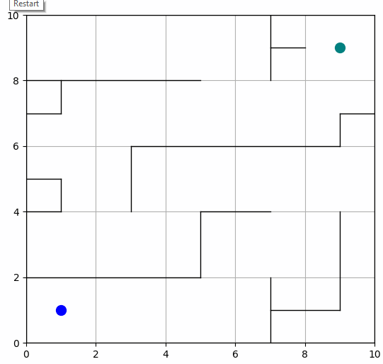
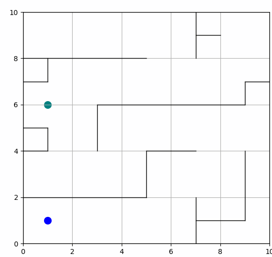

# Path Planning App

This project is a path planning application that helps determine a path from a start point to an end point using various algorithms.  

# Data

The available algorithms include A*, Dijkstra, Breadth-First Search (BFS), Depth-First Search (DFS), Rapidly-exploring Random Trees (RRT), RRT*, and RRT-Connect.

- Fruits:
  banana, apple, pear, grapes, orange, kiwi, watermelon, pomegranate, pineapple, mango

- Vegetables:
  cucumber, carrot, onion, potato, lemon, tomato, raddish, beetroot, cabbage, lettuce, spinach, soy bean, cauliflower, pepper, chilli pepper, turnip, corn, sweetcorn, sweet potato, jalepeño, ginger, garlic, peas, eggplant


## Features

- demonstrates the operation of the selected path planning algorithm
- `PathPlanning` directory contains implemented algorithms
- `Maps`directory contains implemented maps
- `plotter.py` is python script used to run application (interactive matplotlib GUI)
- all animations and images are stored in `/images`

## Installation

1. Clone the repository:

    ```bash
    git clone https://github.com/your-username/path-planning.git

2. Navigate to the project directory:

    ```bash
    cd path-planning

3. Install the required dependencies:

    ```bash
    pip install -r requirements.txt

## Usage

1. To use the application, run the Python script plotter.py, which provides the following functionality:

    ```bash
    plotter.py

- **Choose Map**: You can select the type of map you want to use (map preview displayed on the left side). By default, an empty map is loaded.

- **Enter Start and End Points**: You can input the coordinates of the start and end points. The default values are (1, 1) for the start point and (9, 9) for the end point.

- **Select Algorithm**: You can choose the algorithm you want to use for path planning. By default, the A* algorithm is selected.

- **Update Data**: After entering the start and end points, click the "Set" button to update the data.

- **Select Visualization Mode**: Before starting the path planning procedure, you can choose whether to visualize only the final path or step-by-step progress (note that RRT algorithms may take longer for distant points).

- **Start Planning Path**: Click the "Start Planning Path" button to initiate the path planning process using the selected algorithm and display the result. 

Please note that for distant points, RRT algorithms may require more time to compute the path (it is recommended to check "show only result" when selecting tree algorithms). The application provides visual representations of the maps, obstacles, start, and end points, along with the generated paths based on the chosen algorithm.

In addition, the `PathPlanning/SingleRun` folder contains a single implementation of each algorithm, just run the appropriate python script

## Path Planning
# A* algorithm
This is a 2D grid based the shortest path planning with A* algorithm.


# Dijkstra algorithm
This is a 2D grid based the shortest path planning with Dijkstra's algorithm.


# Breadth First Search (BFS) algorithm
This is a 2D grid based the shortest path planning with Breadth-First Search algorithm.


# Depth First Search (DFS)
This is a 2D grid based path planning with Depth First Search algorithm.


# Rapidly-Exploring Random Trees (RRT) algorithm
This is a path planning code with RRT.


# RRT* algorithm
This is a path planning code with RRT*.


# RRT-Connect algorithm
This is a path planning code with RRT.


## Examples
- A*


- Dijkstra


- BFS and DFS


- RRT


- RRT*


- RRT-Connect


## License
MIT License